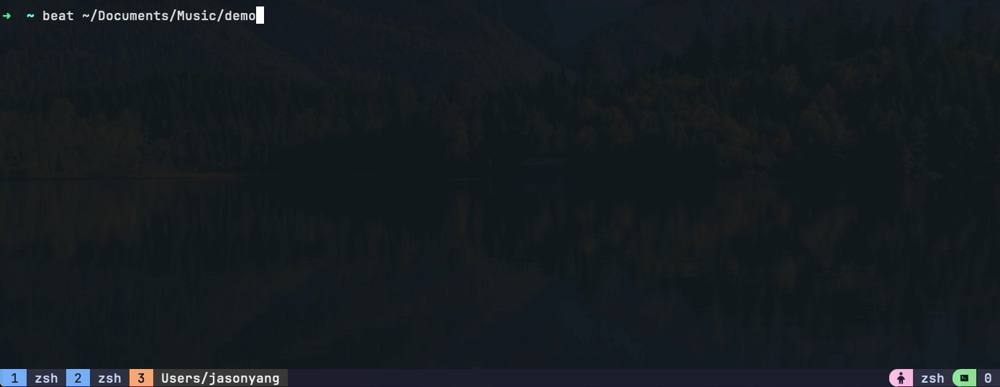

# Beat

A minimalist terminal-based music player built with Rust.



## Installation

### Prerequisites
- Rust

### Install from GitHub
```bash
cargo install --git https://github.com/jasonshyang/beat.git
```

This will install `beat` to `~/.cargo/bin/`.

### Build without installing
```bash
git clone https://github.com/jasonshyang/beat.git
cd beat
cargo build --release
```

## Usage

### Running Beat
```bash
# If installed via cargo install
beat

# Optionally, start in a specific directory
beat /path/to/music

# Or run from project directory
cargo run
```

### Keyboard Controls

#### Browser Mode
- `↑/k` - Move selection up
- `↓/j` - Move selection down
- `Enter` - Play selected track or enter directory
- `a` - Add all tracks to queue
- `Tab` - Switch between tabs (Browser/Queue)

#### Player Controls
- `Space` - Play/Pause
- `n` - Next track
- `b` - Toggle browser visibility

#### General
- `h` - Show help
- `Shift+Q` - Quit
